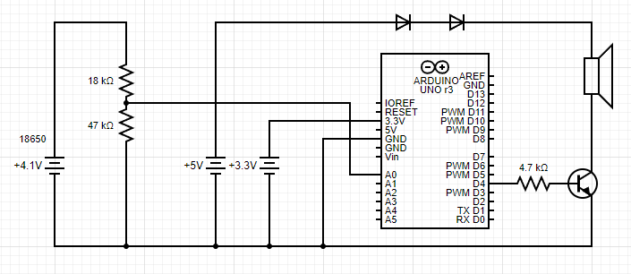

# HappyBDayPrank
Revenge is a bitch

## Circuit diagram

https://crcit.net/c/d50fdca6a4dc4d62a5e681dd06756091

The "Arduino" in the diagram is actually a Wemos D1. The battery source(s) is an 18650 shield which provides both 3.3V and 5V. Since the original birthdaycard comes with 3 LR1130 batteries for a total of 3.6V we need two dropper diodes which both drop about 0.7V. The 4K7Ω resistor limits the current. The 47KΩ and 18KΩ voltage divider ensure we get 0 to ~3.3V on pin A0 which we can then use to read the voltage and even report it back to home.

## BOM

- 1x [18650 shield](https://www.aliexpress.com/item/4001251319520.html)
- 1x [Wemos D1](https://www.aliexpress.com/item/1005001344360716.html)
- 1x [Never-Ending Birthday Card](https://www.coolgift.com/nl/Never-Ending-Birthday-Card)
- 2x 1N4001 diode
- 1x 2N2222 NPN BJT
- 1x 4K7Ω resistor
- 1x 47KΩ resistor
- 1x 18KΩ resistor